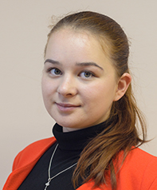
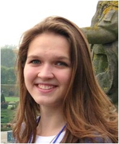

VM2D: Vortex method for 2D flow simulation
==========================================

Copyright (C) 2017-2020 Ilia Marchevsky, Kseniia Kuzmina, Evgeniya Ryatina

Программная реализация (с открытым исходным кодом) вихревых методов вычислительной гидродинамики для моделирования течений вязкой несжимаемой среды. 

Версия 1.8 от 09 марта 2020 г.

ЛИЦЕНЗИЯ
--------

Программа распространяется на условиях свободной лицензии [GNU GPLv3](https://www.gnu.org/licenses/gpl.txt)
   
   
ИСПОЛЬЗУЕМЫЕ МЕТОДЫ
-------------------
   
Настоящая программная реализация основана на: 

* [методе вязких вихревых доменов, МВВД](http://en.wikipedia.org/wiki/Viscous_vortex_domains_method), разработанном под руководством д.ф.-м.н. [Г.Я. Дынниковой](https://ru.wikipedia.org/wiki/Дынникова,_Галина_Яковлевна) в НИИ Механики МГУ им. М.В. Ломоносова,

* методе дискретных вихрей, МДВ, разработанном и развиваемом в научной школе, созданной д.т.н, проф. [С.М. Белоцерковским](https://ru.wikipedia.org/wiki/Белоцерковский,_Сергей_Михайлович),
	 
* результатах исследований многих авторов, опубликованных ими в монографиях, научной периодике, трудах конференций и семинаров,
	 
* собственных разработках авторов.

	 
УСТАНОВКА
---------

Для установки программы VM2D на комьютере необходимо загрузить исходные коды программы.
Если на Вашем компьютере установлен "Git", достаточно исполнить команду 

      git clone https://github.com/vortexmethods/VM2D.git VM2D

по результатам работы которой в текущей папке будет создана подпапка VM2D и в нее будут загружены все файлы из репозитория, включая исходные коды, примеры решаемых задач, скрипты и т.п.	  
	  
Подготовка к компияции исходных кодов предполагает создание папки "build" в каталоге с загруженными исходными кодами, переход в эту папку и выполнение команды 

      cmake ..
	  
При необходимости следует указать необходимые ключи для настройки используемых компиляторов, указания опций компиляции и т.п., возможно, потребуется также некоторая модификация файла "CMakeLists.txt", содержащего параметры настройки CMake.

В частности, для подготовки исходных кодов для их последующей компиляции в Windows средствами MS Visual Studio следует, в зависимости от версии, использовать одну из следующих команд (опция Win64 обязательна для использования возможности проведения вычислений на графических картах Nvidia CUDA, для Visual Studio 2019 она включена по умолчанию для 64-битных систем)

      cmake -G"Visual Studio 12 2013 Win64" ..
      cmake -G"Visual Studio 14 2015 Win64" ..
      cmake -G"Visual Studio 15 2017 Win64" ..
      cmake -G"Visual Studio 16 2019" -A x64 ..
	  
Дальнейшая компиляция кода зависит от используемой операционной системы. В Windows, как правило, при помощи CMake будет создан проект для его поледующего открытия и компиляции средствами MS Visual Studio (см. выше), в Linux достаточно исполнения из созданной папки команды

      make

Если компиляция (в Linux) завершается ошибкой, связанной с отсутствием необходимых библиотек MPI, можно попробовать очистить папку build, перейти в нее и вместо команды cmake .. исполнить команду

      CXX=mpiCC cmake ..
	  
и после ее успешного выполнения повторить компиляцию при помощи команды make.	  

В случае использования компилятора, отличного от используемого по умолчанию (в Windows это, как правило, встроенный в MS Visual Studio, в Linux -- gcc/g++), например, компилятора Intel, при подготовке исходных кодов к компиляции необходимо указать, в зависимости от версии, ключ (отметим, что Intel C++ Compiler 19 по умолчанию не интегрируется в Visual Studio 2019, и его использование требует дополнительных "ручных" настроек)

      -T"Intel C++ Compiler XE 13.0"
      -T"Intel C++ Compiler XE 14.0"
      -T"Intel C++ Compiler XE 15.0"
      -T"Intel C++ Compiler 16.0"
      -T"Intel C++ Compiler 17.0"
      -T"Intel C++ Compiler 18.0"
	  -T"Intel C++ Compiler 19.0"
	 
РАБОТА С CUDA
-------------
	 
При наличии в системе установленного [CUDA Toolkit](https://developer.nvidia.com/cuda-toolkit) в ходе работы cmake программа будет автоматически сконфигурирована для счета с использованием возможностей графических карт, работающих по технологии NVidia CUDA.

 
При выполнении расчетов на узле, на котором установлено несколько видеокарт, по умолчанию все расчеты будут производиться на устройстве с индексом #0. Чтобы этого избежать, нужно открыть файл исходного кода VM2D/src/VM2D/Gpu2D/Gpu2D.cpp, прочитать написанные в нем комментарии и откомментировать нужную строку.
	 
Если при наличии установленного CUDA Toolkit планируется производить расчет на центральных процессорах, не привлекая возможности GPU, то в файле VM2D/CMakeLists.txt требуется закомментировать строку

      add_definitions(-DUSE_CUDA)
	  
добавив перед ней знак #, чтобы получилось
	  
	  #add_definitions(-DUSE_CUDA)
	  
	  
ЗАПУСК
------	  
	  	  
Запуск программы осуществляется из той папки, в которой хранится описание решаемой (решаемых) задач вызовом команды

      VM2D

(при необходимости -- с указанием полного пути к скомпилированному исполняемому файлу; этот путь можно указать в системной переменной "PATH")	

НЕОБХОДИМОЕ ПО
--------------

Для компиляции требуется наличие установленных: 

* системы автоматизации сборки программного обеспечения из исходного кода [cmake](https://cmake.org/),
* компилятора с языка C++, поддерживающего технологию OpenMP и стандарт С++11,
* реализации MPI,
* библиотеки [Eigen](http://eigen.tuxfamily.org) (не обязательно, исходные коды находятся в папке "include"),
* при наличии в системе графического процессора Nvidia, поддерживающего технологию [CUDA](https://ru.wikipedia.org/wiki/CUDA), для его использования необходим [CUDA Toolkit](https://developer.nvidia.com/cuda-toolkit).

ДОКУМЕНТАЦИЯ К КОДУ
-------------------

[Документация разработчика](http://vortexmethods.github.io/VM2D), генерируемая автоматически средствами [doxygen](http://www.doxygen.org) доступна по ссылке

      http://vortexmethods.github.io/VM2D
  
Документация пользователя будет подготовлена и сделана общедоступной через некоторое время.

КРАТКАЯ ИСТОРИЯ ВЕРСИЙ
----------------------

* Версия 1.0 представлена 1 декабря 2017 г. на конференции [ISPRASOpen](http://www.ispras.ru/reports/opencloudconf-2017.php) (Москва). [Презентация pptx](https://github.com/vortexmethods/PresentationVM2D/blob/master/Presentation-1.0.pptx)

* Версия 1.1 представлена 2 апреля 2018 г. на конференции [ПаВТ](http://agora.guru.ru/display.php?conf=pavt2018) (Ростов-на-Дону). 

* Версия 1.2 представлена 14 июня 2018 г. на конференции [ECCM-ECFD](http://www.eccm-ecfd2018.org/frontal/introduction.asp) (Глазго). 

* Версия 1.3 представлена 26 сентября 2018 г. на конференции в [БГТУ "ВоенМех"](https://www.voenmeh.ru/science/conferences/gasjets) (Санкт-Петербург). [Презентация pdf](https://github.com/vortexmethods/PresentationVM2D/blob/master/Presentation-1.3.pdf)

* Версия 1.4 представлена 16 октября 2018 г. на конференции [ICVFM](http://icvfm2018.xjtu.edu.cn/) (Сиань, КНР). [Презентация pdf](https://github.com/vortexmethods/PresentationVM2D/blob/master/Presentation-1.4.pdf)

* Версия 1.5 представлена 20 февраля 2019 г. на конференции [Topical Problems of Fluid Mechanics](http://www.it.cas.cz/fm/) (Прага). 

* Версия 1.6 представлена 28 октября 2019 г. на конференции [Particles](https://congress.cimne.com/particles2019/) (Барселона). 

* Версия 1.7 представлена 22 ноября 2019 г. на конференции [ISPRASOpen](https://www.isprasopen.ru/) (Москва). 

* Версия 1.8 представлена 09 марта 2020 г. 

ВОПРОСЫ, ПРЕДЛОЖЕНИЯ И ЗАМЕЧАНИЯ
--------------------------------

На [странице Issues](https://github.com/vortexmethods/VM2D/issues) мы будем рады ответить на Ваши вопросы, с благодарностью выслушаем предложения и замечания по коду.

Мы открыты для любого конструктивного взаимодействия!

---
С глубоким уважением,
разработчики

<table width="500" border="0" cellpadding="5">

<tr>

<td align="center" valign="center" width="20%">

 
Марчевский Илья Константинович
</td>

<td align="center" valign="center" width="20%">

 
Кузьмина Ксения Сергеевна
</td>

<td align="center" valign="center" width="20%">

 
Рятина Евгения Павловна
</td>

</tr>

</table>
