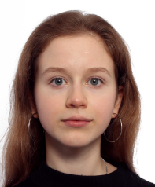

VM2D: Vortex method for 2D flow simulation
==========================================

Copyright (C) 2017-2024 Ilia Marchevsky, Kseniia Sokol, Evgeniya Ryatina, Aleksandra Kolganova

Software implementation (with open source code) of vortex particle method in computational fluid dynamics for viscous incompressible flows simulation.

Version 1.12 dated January 14, 2024

LICENSE
--------

The program is distributed under the terms of a free license [GNU GPLv3](https://www.gnu.org/licenses/gpl.txt)
   
   
THE USED METHODS
-------------------
   
This software implementation is based on:

* [viscous vortex domains method, VVD method](http://en.wikipedia.org/wiki/Viscous_vortex_domains_method), developed under the guidance of Doctor of Physical and Mathematical Sciences. [G.Ya. Dynnikova](https://ru.wikipedia.org/wiki/Дынникова,_Галина_Яковлевна) at the Institute of Mechanics of Lomonosov Moscow State University,

* the discrete vortex method, DV method, developed and advanced in the scientific school created by Doctor of Technical Sciences, Prof. [S. M. Belotserkovsky](https://ru.wikipedia.org/wiki/Белоцерковский,_Сергей_Михайлович),
	 
* the results of research by many authors published in monographs, scientific periodicals, conference proceedings and seminars,
	 
* the authors' original models and algorythms.

CODE DOCUMENTATION
-------------------

[Developer documentation](http://vortexmethods.github.io/VM2D), generated automatically by tools of [doxygen](http://www.doxygen.org), is available by the link below
 
      http://vortexmethods.github.io/VM2D
  
[User documentation](https://vm2d.readthedocs.io/en/latest), generated by tools of [Read the Docs](https://readthedocs.org), is in progress, the current version is available by the link below

      https://vm2d.readthedocs.io/en/latest

THE BRIEF VERSION HISTORY
----------------------

* Version 1.0 was announced on December 1, 2017 at the conference [ISPRASOpen](http://www.ispras.ru/reports/opencloudconf-2017.php) (Moscow). [Presentation pptx](https://github.com/vortexmethods/PresentationVM2D/blob/master/Presentation-1.0.pptx)

* Version 1.1 was announced on April 2, 2018 at the conference [PaVT](http://agora.guru.ru/display.php?conf=pavt2018) (Rostov-on-Don).

* Version 1.2 was announced on June 14, 2018 at the conference [ECCM-ECFD](http://www.eccm-ecfd2018.org/frontal/introduction.asp) (Glasgow).

* Version 1.3 was announced on September 26, 2018 at the conference at [BSTU "Voenmeh"](https://www.voenmeh.ru/science/conferences/gasjets) (St. Petersburg). [Presentation pdf](https://github.com/vortexmethods/PresentationVM2D/blob/master/Presentation-1.3.pdf)

* Version 1.4 was announced on October 16, 2018 at the conference [ICVFM](http://icvfm2018.xjtu.edu.cn/) (Xi'an, China). [Presentation pdf](https://github.com/vortexmethods/PresentationVM2D/blob/master/Presentation-1.4.pdf)

* Version 1.5 was announced on February 20, 2019 at the conference [Topical Problems of Fluid Mechanics](http://www.it.cas.cz/fm/) (Prague).

* Version 1.6 was announced on October 28, 2019 at the conference [Particles](https://congress.cimne.com/particles2019/) (Barcelona).

* Version 1.7 was announced on November 22, 2019 at the conference [ISPRASOpen](https://www.isprasopen.ru/) (Moscow).

* Version 1.8 was released on March 09, 2020.

* Version 1.9 was released on July 22, 2020.

* Version 1.10 was announced on May 17, 2021 at the conference [ParCFD](https://parcfd2020.sciencesconf.org/) (Nice, France).

* Version 1.11 was announced on August 8, 2022 at the conference [ICMAR](http://conf.nsc.ru/icmar2022/) (Novosibirsk).

* Version 1.12 was announced on January 22, 2024 at a seminar at [Hohai University](https://en.hhu.edu.cn/) (Nanjing, China).

QUESTIONS, SUGGESTIONS AND COMMENTS
--------------------------------

On the page [Issues](https://github.com/vortexmethods/VM2D/issues) we will gladly answer Your questions and will be grateful to hear your suggestions and comments on the code.

We are open to any constructive interaction!

---
With deep respect, 
developers

<table width="500" border="0" cellpadding="5">
<tr>
<td align="center" valign="center" width="200">

 
Marchevsky
 
Ilia
</td>
<td align="center" valign="center" width="200">

 
Sokol
 
Ksenia
</td>
<td align="center" valign="center" width="200">

 
Ryatina
 
Evgenia
</td>
<td align="center" valign="center" width="200">

 
Kolganova
 
Alexandra
</td>
</tr>
</table>

The authors thank their colleagues for their help in developing the code.

<table width="500" border="0" cellpadding="5">

<tr>
</td>
<td align="center" valign="center" width="160">

 
Shcheglov
 
Georgiy
</td>
<td align="center" valign="center" width="160">

 
Izmailova
 
Yulia
</td>
<td align="center" valign="center" width="160">

 
Korobova
 
Irina
</td>
<td align="center" valign="center" width="160">

 
Serebrovskaya
 
Ekaterina
</td>
<td align="center" valign="center" width="160">

 
Kobzar
 
Daria
</tr>
</table>

